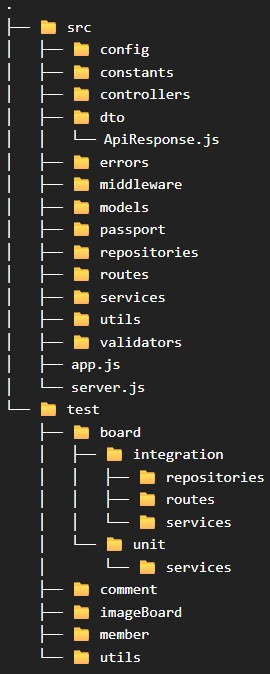

# BoardProject REST API Express version

<br/>
<br/>

## 프로젝트 개요

### 프로젝트 목적
- **자율성 기반의 규격 수립**: 프레임워크의 제약이 적은 Express 환경에서 Layered Architecture와 응답 표준화를 직접 설계 및 적용하여, 높은 자유도 속에서 안정적인 유지보수 체계를 구축하는 역량 확보
- **개발 환경 최적화**: Path Alias 설정, 모듈 의존성 관리, 환경별 에러 노출 전략 등 프로젝트 운영에 필요한 세부 설정들을 직접 구성하며 최적의 개발 환경 구축 역량 강화

<br/>

### 프로젝트 요약
이 프로젝트는 소규모 커뮤니티 서비스를 직접 기획, 설계하여 새로운 기술 스택을 도입할 때 기준점으로 활용하는 테스트베드입니다.

CRUD, 파일 시스템 관리, 계층형 쿼리 등 백엔드의 핵심 기능을 구현하며 각 환경의 특성을 분석하고 있습니다.   
현재는 React 기반의 공통 프론트엔드를 고정하고, 백엔드를 다양한 언어와 프레임워크로 재구현하며 아키텍처의 유연성을 검증하고 있습니다.


#### 프로젝트 버전
1. Spring MVC & JSP, Oracle (<a href="https://github.com/Youndae/BoardProject">Git Repo Link</a>)
  - 초기 설계 및 파일 관리 비즈니스 로직 확립한 최초 버전입니다.
  - 당시 가장 익숙했던 Spring MVC, JSP 환경을 사용하고 새롭게 Oracle을 사용해보며 MySQL과의 문법 및 동작 차이를 학습했습니다.
  - 설계 당시 주요 과제였던 효율적인 파일 관리 문제를 성공적으로 해결해 구현했습니다.
2. Servlet & JSP, JDBCTemplate, MySQL (<a href="https://github.com/Youndae/BoardProject_servlet_jsp">Git Repo Link</a>)
  - 프레임워크의 추상화 계층을 제외한 Legacy 환경에서 요청 처리 흐름을 Low-level부터 파악했습니다.
  - JPA나 MyBatis 없이 JDBCTemplate을 직접 제어하며 영속성 계층의 동작 원리와 프레임워크가 제공하는 편의성의 실체를 체감했습니다.
3. REST API & React
  1. 공통 프론트엔드 (<a href="https://github.com/Youndae/boardProject_client_react">Git Repo Link</a>)
    - React(JSX)를 이용한 최초의 SPA 환경 구축 프로젝트입니다.
    - Axios 기반 통신 구조를 설계하고 컴포넌트 단위로 책임을 분리하여 유지보수성을 높였습니다.
    - 분리된 구조를 활용해 다양한 백엔드 스택의 REST API를 테스트하는 범용 프론트엔드로 활용중입니다.
  2. Spring Boot, JPA, MySQL 버전 (<a href="https://github.com/Youndae/rest-api-project">Git Repo Link</a>)
    - API 서버(board-rest)와 Client 서버(board-app)를 각각 독립적으로 구축했습니다.
    - board-rest(API Server)
      - 서비스의 핵심 비즈니스 로직 및 인증 / 인가를 전담하는 API 서버입니다.
      - JPA를 사용했으며, 데이터를 제공합니다.
    - board-app(View-Centric Server)
      - 자체 DB 없이 WebClient를 사용하여 board-rest와 통신하는 독립 실행 서버입니다.
      - 사용자로부터 받은 인증 정보와 요청을 API 서버로 전달하는 역할을 수행하며, Thymeleaf를 통해 사용자에게 view를 제공합니다.
      - 백엔드와 프론트엔드를 분리해 WebClient로 통신하는 환경 구축을 목적으로 설계하였으며, 서버간 통신 시 발생하는 데이터 직렬화 및 예외 처리 과정을 학습했습니다.
      - React 프론트엔드 구축 이후 리팩토링을 중단한 상태입니다.
  3. Kotlin, Spring Boot 버전 (<a href="https://github.com/Youndae/boardproject_kt">Git Repo Link</a>)
    - Java와 Kotlin의 차이점을 분석하고, data class를 활용한 불변 객체 통제 기법을 학습했습니다.
    - Clean Architecture를 적용하여 도메인 중심 설계를 지향하며, 엄격한 계층 분리가 가져오는 생산성 저하와 같은 실질적인 단점을 분석하고 해결책을 고민했습니다.
  4. Express 버전
    - Spring 환경을 벗어나 Middleware 기반 아키텍처의 빠른 응답 처리와 서비스 레이어의 부담 완화 라는 장점을 확인했습니다.
    - 프레임워크 차원의 트랜잭션 관리 부재로 인해 통합 테스트 시 발생하는 데이터 정합성 관리의 복잡성을 체감했으며, 이를 보완하기 위한 테스트 환경 설계 역량을 키웠습니다.
  5. Nest 버전 (<a href="https://github.com/Youndae/boardproject_nest">Git Repo Link</a>)
    - Module 구조를 통한 체계적인 의존성 관리 방식을 학습했습니다.
    - 의존성 증가에 따라 모듈이 무거워질 수 있다는 단점을 파악하고, 효율적인 모듈 바운더리 설정이 NestJS 설계의 핵심임을 이해했습니다.
    - TypeScript의 엄격한 타입을 통해 Runtime 이전 단계에서의 안정성 확보를 경험했습니다.
 
## 목차
<strong>1. [개발 환경](#개발-환경)</strong>   
<strong>2. [프로젝트 구조 및 설계 원칙](#프로젝트-구조-및-설계-원칙)</strong>   
<strong>3. [ERD](#ERD)</strong>   
<strong>4. [기능 목록](#기능-목록)</strong>   
<strong>5. [핵심 기능 및 문제 해결](#핵심-기능-및-문제-해결)</strong>   
<strong>6. [프로젝트 회고](#프로젝트-회고)</strong>

<br/>
<br/>

## 개발 환경
|Category|TechStack|
|---|---|
|Backend|- Node.js <br/> - Express 5.1 <br/> - Sequelize <br/> - Path Alias|
|Security / Auth|- Passport.js <br/> - JWT(jsonwebtoken) <br/> - Bcrypt <br/>|
|Database|- MySQL <br/> - Redis|
|Validation|- Zod|
|File|- Multer <br/> - Sharp <br/> - fs-extra|
|Infrastructure / DevOps|- Winston(Logging & Daily Rotate) <br/> - Morgan <br/> - dotenv-flow|
|Testing|- Jest(Unit & Integration Test) <br/> - Supertest(E2E API Test)|

<br/>
<br/>

## 프로젝트 구조 및 설계 원칙

### 구조 설계



프로젝트 구조는 관심사의 명확한 분리와 유지보수성을 최우선으로 고려하여 설계했습니다.   

- **Layered Architecture**: 각 계층을 Directory 단위로 엄격히 분리하여 레이어간 의존성을 관리했습니다.
- **도메인 기반 파일 분리**: 각 레이어 내부는 도메인 단위의 파일로 분리하여 코드의 가독성을 높였습니다.
- 서비스 계층의 세분화
  - 도메인 비즈니스 로직 뿐만 아니라 공통 인프라 로직인 file, JWT등의 확장성을 고려하여 services/ 내부에는 도메인별 Directory 구조를 채택했습니다.
  - 이를 통해 서비스 간 결합도를 낮추고 재사용성을 극대화했습니다.
- 테스트 전략
  - 단위 테스트와 통합 테스트의 명확한 역할 분담을 통해 코드의 안정성을 검증했습니다.
  - **도메인 중심 테스트 구조**: 테스트 Directory를 도메인별로 최상위 분리하여, 특정 기능 변경 시 관련 테스트를 즉각적으로 식별할 수 있도록 설계했습니다.
  - **통합, 단위 테스트 구조**: Repository, E2E, Services Integration 테스트와 단위 테스트로 나눠 테스트를 설계했습니다. 핵심 비즈니스 로직의 순수성을 보장하는 데 집중했습니다.
  
Spring의 안정적인 Architecture 구조를 Node.js 환경에 적용하여, 유지보수가 용이하며 테스트로 증명된 안정적인 백엔드 시스템을 설계했습니다.


### API 응답 표준화
 
Node.js의 자유로운 객체 설계 구조에서도 일관된 클라이언트 인터페이스를 유지하기 위해 ApiResponse와 Error Handler를 표준화 했습니다.


1. ApiResponse를 통한 응답 구조 표준화
   - **응답 규격 강제**: code, message, content, timestamp를 공통 포맷으로 설계하여 클라이언트에서 받는 데이터 일관성을 보장했습니다.
   - **불변 객체화**: Object.freeze()를 호출해 응답 객체가 생성된 후 임의로 수정되는 것을 차단하여 데이터 무결성을 확보했습니다.
   - **Static Factory Method**: success, created 등의 정적 메서드를 제공하여 가독성을 높이고, 기본 메시지 설정을 통해 개발 편의성을 개선했습니다.
   - **Express Response 객체 확장**: responseHandler 미들웨어를 통해 res 객체에 success, created 등의 메서드를 주입했습니다. 이를 통해 별도의 DTO import 없이 res.success(data)와 같이 직관적인 호출만으로 표준 규격을 유지할 수 있게 설계했습니다.

<details>
  <summary><strong>✔️ 표준 응답 객체 코드</strong></summary>

```javascript
import {ResponseStatus} from "#constants/responseStatus.js";

class ApiResponse {

  /**
   *
   * @param {number} code - HTTP Status Code
   * @param {string} message - Response Message
   * @param {any} content - Response Data (Default Empty Object)
   */
  constructor(code, message, content = {}) {
    this.code = code;
    this.message = message;
    this.content = content;
    this.timestamp = new Date().toISOString();

    Object.freeze(this);
  }

  static success(content = {}, message = ResponseStatus.OK.MESSAGE) {
    return new ApiResponse(ResponseStatus.OK.CODE, message, content);
  }

  static successWithMsg(message) {
    return new ApiResponse(ResponseStatus.OK.CODE, message, {});
  }

  static created(content = {}, message = ResponseStatus.CREATED.MESSAGE) {
    return new ApiResponse(ResponseStatus.CREATED.CODE, message, content);
  }
}

export default ApiResponse;
```

```javascript
// responseHandler.js
import ApiResponse from "#dto/ApiResponse.js";

export const responseHandler = (req, res, next) => {
  res.success = (content, message) => {
    const response = ApiResponse.success(content, message);
    return res.status(response.code).json(response);
  };

  res.successWithMsg = (message) => {
    const response = ApiResponse.successWithMsg(message);
    return res.status(response.code).json(response);
  }

  res.created = (content, message) => {
    const response = ApiResponse.created(content, message);
    return res.status(response.code).json(response);
  };

  next();
}
```

```javascript
// app.js
//...
import { responseHandler } from '#middleware/responseHandler.js'
//...

app.use(responseHandler);
//...
```

</details>

2. 에러 핸들링
   - **미들웨어 통합 처리**: app.js 하단에서 모든 예외를 수집하여 동일한 구조로 응답합니다. 로직 내 발생하는 예외는 대부분 CustomError로 추상화하여 상수화된 상태 코드와 메시지를 사용합니다.
   - **Multer 예외 분기**: 파일 업로드 과정에서 발생하는 MulterError를 세분화하여, 용량 초과나 개수 초과 등 구체적인 오류 상황을 클라이언트에 전달합니다.
   - **환경별 노출 전략**: 운영 환경이 아닐 경우에만 Error Stack을 응답에 포함시켜 개발 단계에서의 디버깅 효율을 높였습니다.

<details>
  <summary><strong>✔️ 에러 핸들링 코드</strong></summary>

```javascript
// app.js
//...
app.use((err, req, res, next) => {
  console.error(err);

  if(err.constructor.name === 'MulterError') {
    let errorStatus = ResponseStatus.FILE_UPLOAD_ERROR;

    if(err.code === 'LIMIT_UNEXPECTED_FILE')
      errorStatus = ResponseStatus.TOO_MANY_FILES;
    else if(err.code === 'LIMIT_FILE_SIZE')
      errorStatus = ResponseStatus.FILE_SIZE_TOO_LARGE;

    return res.status(errorStatus.CODE)
            .json({
              status: errorStatus.CODE,
              message: errorStatus.MESSAGE,
            })
  }

  console.error('app error handling : ', err);
  const status = err.status || 500;
  const message = err.message || 'Server Error';

  res.status(status).json({
    status,
    message,
    ...(process.env.NODE_ENV !== 'production' && { stack: err.stack }),
  });
});
```

</details>

다양한 기술 스택을 유연하게 수용하는 프로젝트의 설계 원칙을 반영해 반복되는 응답 구성 로직을 미들웨어 계층으로 위임하여, 컨트롤러가 응답 규격 생성이라는 부가 책임에서 벗어나 핵심 비즈니스 로직에만 집중할 수 있는 구조를 구축했습니다.

<br/>
<br/>

## ERD


<br/>
<br/>

## 기능 목록

<details>
    <summary><strong>계층형 게시판</strong></summary>

* 게시글 목록
    * 게시글 검색( 제목, 작성자, 제목 + 내용 )
    * 페이지네이션
    * 계층형 구조
* 게시글 상세
    * 작성자의 게시글 수정, 삭제, 답글 작성
    * 로그인한 사용자의 답글 작성, 댓글 작성
    * 로그인한 사용자의 대댓글 작성
    * 댓글 작성자의 댓글 삭제
    * 댓글 페이지네이션
* 게시글 작성
* 게시글 수정
* 답글 작성
</details>

<br/>

<details>
    <summary><strong>이미지 게시판</strong></summary>

* 게시글 목록
    * 게시글 검색 ( 제목, 작성자, 제목 + 내용 )
    * 페이지네이션
* 게시글 상세
    * 작성자의 게시글 수정, 삭제, 답글 작성
    * 로그인한 사용자의 답글 작성, 댓글 작성
    * 로그인한 사용자의 대댓글 작성
    * 댓글 작성자의 댓글 삭제
    * 댓글 페이지네이션
* 게시글 작성
    * 이미지 파일 업로드(최소 1장 필수. 최대 5장)
    * 텍스트 내용 작성
* 게시글 수정
    * 기존 이미지 파일 삭제
    * 추가 이미지 업로드(기존 파일 포함 최대 5장)
</details>

<br/>
<br/>

## 핵심 기능 및 문제 해결

<br/>

### 목차
1. **[이미지 파일 처리 및 리사이징](#이미지-파일-처리-및-리사이징)**
2. **[예외 발생 시 파일 관리](#예외-발생-시-파일-관리)**
3. **[페이징 결과 표준화 및 공통 로직 처리](#페이징-결과-표준화-및-공통-로직-처리)**

<br/>
<br/>

### 이미지 파일 처리 및 리사이징
파일 업로드는 Multer 기반의 업로드 파이프라인과 Sharp를 활용한 리사이징 로직을 결합했습니다.   
배포 계획을 따로 세우지 않아 로컬 파일 시스템에 저장하도록 구현했습니다.

1. Multer
   - **개발 및 테스트 환경 분리**: 개발 환경에서는 diskStorage를 통해 물리적 파일 시스템에 저장하고, 테스트 환경에서는 memoryStorage를 사용하여 I/O 병목과 테스트 데이터 오염을 방지했습니다.
   - **테스트 일관성 확보**: memoryStorage 사용시 사라지는 파일명 정보를 _handleFile 오버라이딩을 통해 주입함으로써, 테스트 환경에서도 개발 환경과 동일한 파일명 규격을 유지하도록했습니다.
   - **업로드 필터링**: fileFilter와 확장자 검증을 통해 이미지 파일만 수용하며, 단일 / 다중 업로드 및 용량 제한을 미들웨어에서 강제했습니다.

<details>
    <summary><strong>✔️ uploadMiddleware.js 코드</strong></summary>

```javascript
import multer from 'multer';
import fs from 'fs';
import path from 'path';
import { v4 as uuidv4 } from 'uuid';
import CustomError from '#errors/customError.js';
import { ResponseStatus } from '#constants/responseStatus.js';

const profilePath = process.env.PROFILE_FILE_PATH;
const boardPath = process.env.BOARD_FILE_PATH;

if (process.env.NODE_ENV !== 'test') {
    [profilePath, boardPath].forEach((dir) => {
        fs.mkdirSync(dir, { recursive: true });
    });
}

const createFilename = (file) => {
    const ext = path.extname(file.originalname);

    const allowedExt = ['.jpg', '.jpeg', '.png', '.gif', '.bmp', '.webp'];
    if(!allowedExt.includes(ext))
        throw new CustomError(ResponseStatus.FILE_UPLOAD_ERROR);

    return `${Date.now()}${uuidv4()}.jpg`;
};

const imageFileFilter = (req, file, cb) => {
    if(file.mimetype.startsWith('image/'))
        cb(null, true);
    else
        cb(new CustomError(ResponseStatus.FILE_UPLOAD_ERROR), false);
};

// test 전용 memoryStorage + filename 주입
const createMemoryStorageByTest = () => {
    const storage = multer.memoryStorage();

    return {
        _handleFile(req, file, cb) {
            storage._handleFile(req, file, (err, info) => {
                if(err)
                    return cb(err);
                info.filename = createFilename(file);
                cb(null, info);
            });
        },
        _removeFile: storage._removeFile,
    }
}

const createStorage = (destination) => {
    if(process.env.NODE_ENV === 'test')
        return createMemoryStorageByTest();

    return multer.diskStorage({
        destination: (req, file, cb) => cb(null, destination),
        filename: (req, file, cb) => {
            const filename = createFilename(file);
            cb(null, filename);
        },
    });
}

export const profileUpload = multer({
    storage: createStorage(profilePath),
    fileFilter: imageFileFilter,
    limits: { fileSize: 1024 * 1024 * 5 },
})
    .single("profile");

export const boardUpload = multer({
    storage: createStorage(boardPath),
    fileFilter: imageFileFilter,
    limits: { fileSize: 1024 * 1024 * 5 },
})
    .array('files', 5);
```

</details>

2. Sharp 기반의 이미지 리사이징
   - **멀티 사이즈 대응**: 게시글의 경우 썸네일과 상세 보기 등 다양한 UI 환경, 브라우저 사이즈에 대응하기 위해 300px, 600px 규격으로 병렬 리사이징을 수행하여 처리 속도를 최적화했습니다.
   - **리소스 최적화 및 포맷 통일**: 업로드된 원본의 확장자와 관계없이 jpeg 포맷으로 변환 저장하여 이미지 품질 대비 용량 효율을 높였습니다.
   - 데이터 목적별 원본 관리
     - **프로필**: 일반적으로 원본 사이즈 전체를 보여주는 경우가 없으므로 저장공간 절약을 위해 리사이징 후 원본을 즉시 제거 합니다.
     - **게시글**: 원본은 유지하되 Sharp를 거친 최적화된 파일로 덮어쓰기를 수행하여 파일의 정합성을 관리합니다.

<details>
    <summary><strong>✔️ resize.js 코드</strong></summary>

```javascript
import sharp from 'sharp';
import path from 'path';
import fs from 'fs';
import { getBaseNameAndExt } from './fileNameUtils.js';

const profilePath = process.env.PROFILE_FILE_PATH;
const boardPath = process.env.BOARD_FILE_PATH;

export const profileResize = async (filename) => {
	await resizeImage(filename, [300], profilePath, { deleteOriginal: true });
}

export const boardResize = async (filename) => {
	console.log('boardResize filename', filename);
	await resizeImage(filename, [300, 600], boardPath, { deleteOriginal: false });
}

const resizeImage = async(filename, sizes, uploadPath, options = {}) => {
	if(process.env.NODE_ENV === 'test') {
		console.log('test mode. skip resize');
		return;
	}
	
	const { baseName, ext } = getBaseNameAndExt(filename);
	const inputPath = path.join(uploadPath, filename);

	try {
		await Promise.all(
			sizes.map(size => {
				const outputPath = path.join(uploadPath, `${baseName}_${size}${ext}`);
				return sharp(inputPath) // 파일을 읽어서 이미지 데이터(buffer)를 메모리에 올려둠
					.resize(size, size, { fit: 'inside' }) // 가로 세로 옵션.
					.toFormat('jpeg')
					.toFile(outputPath); // 리사이징 된 데이터를 디스크에 저장.
			})
		);

		if(options.deleteOriginal){
			fs.unlinkSync(inputPath);
		} else {
			const tempPath = path.join(uploadPath, `temp_${filename}`);
			await sharp(inputPath)
				.toFormat('jpeg')
				.toFile(tempPath);
			fs.renameSync(tempPath, inputPath);
		}
	} catch (error) {
		console.error(error);
		throw error;
	}
}
```
</details>

3. DB 저장 규격   
리사이징 완료 후 서비스 성격에 맞춰 최종적으로 확정된 파일명만을 데이터베이스에 저장합니다.   

   - 파일명 규칙
     - **원본**: {timestamp}{uuid}.jpg
     - **리사이징**: {timestamp}{uuid}_{size}.jpg
   - 프로필
     - 리사이징 사이즈 300 단일로 고정
     - DB에는 원본이 아닌 리사이징 파일명으로 저장
   - 이미지 게시판
     - 리사이징 사이즈 300, 600
     - DB에는 원본 파일명으로 저장


<br/>
<br/>

### 예외 발생 시 파일 관리

파일 업로드 프로세스 중 발생할 수 있는 예외 상황에 대응하여, 물리 파일과 데이터베이스 간의 데이터 무결성을 보장하기 위한 단계별 관리 전략을 수립했습니다.   

1. 컨트롤러 진입 전 미들웨어 단계의 대응   
Express의 구조적 특성 상 Multipart/form-data를 해석하기 위해 Multer가 유효성 검사보다 먼저 실행되어야 하며, 이 과정에서 파일이 물리적으로 선저장되는 기술적 제약이 발생합니다.   
이를 해결하기 위해 도메인별로 특화된 검증 미들웨어를 설계했습니다.

   - 도메인별 검증 분리
     - member, image-board와 같이 파일 업로드가 발생하는 도메인에 맞춰 별도의 validate 미들웨어를 구현했습니다.
   - 즉각적인 파일 제거
     - 유효성 검사 실패시, req.file 혹은 req.files에 담긴 정보를 추적하여 이미 저장된 임시 파일을 즉시 삭제함으로써 스토리지 낭비를 차단했습니다.

<details>
    <summary><strong>✔️ validateMiddleware.js 코드</strong></summary>

```javascript
import CustomError from "#errors/customError.js"
import { ResponseStatus } from "#constants/responseStatus.js"
import {deleteBoardImageFromFiles, deleteImageFile} from "#utils/fileUtils.js";
import {ImageConstants} from "#constants/imageConstants.js";


export const validate = (schema, property = 'body') => (req, res, next) => {
	try {
		schema.parse(req[property]);
		next();
	}catch(error) {
		next(new CustomError(ResponseStatus.BAD_REQUEST));
	}
}

export const memberValidate = (schema, property = 'body') => async (req, res, next) => {
	try {
		schema.parse(req[property]);
		next();
	}catch(error) {
		if(req.file) {
			await deleteImageFile(req.file.filename, ImageConstants.PROFILE_TYPE);
		}
		
		next(new CustomError(ResponseStatus.BAD_REQUEST));
	}
}

export const imageBoardValidate = (schema, property = 'body') => async (req, res, next) => {
	try {
		schema.parse(req[property]);
		next();
	}catch(error) {
		if(req.files) {
			await deleteBoardImageFromFiles(req.files);
		}

		next(new CustomError(ResponseStatus.BAD_REQUEST));
	}
}
```

</details>

메모리 효율을 위해 DiskStorage를 채택함에 따라 발생하는 파일 선저장 문제는 아쉬운 포인트지만, Custom Middleware를 통한 즉시 삭제 로직으로 시스템 무결성을 확보했습니다.   

<br/>

2. 비즈니스 로직 및 서비스 단계의 대응   
리사이징 책임은 컨트롤러가 갖고, 데이터 저장 책임은 서비스가 갖는 구조를 유지하면서도 예외 발생 시에는 공통된 파일 관리 로직이 수행되도록 설계했습니다.

   - **Transaction 연동**: 서비스 계층에서 DB 작업 중 예외 발생 시 Rollback과 동시에 생성된 물리 파일을 삭제합니다.
   - **재귀적 파일 삭제 전략**: image-board 도메인과 같이 하나의 업로드로 인해 원본과 다수의 리사이징 파일이 생성되는 경우, 유틸 함수인 getImageBoardFileNames를 통해 생성된 모든 파생 파일명을 파싱하여 일괄 제거합니다.
   - **환경별 동작 제어**: 실제 운영 환경과 달리 파일 삭제가 빈번하게 일어날 필요가 없는 테스트 환경에서는 불필요한 I/O 작업을 생략하도록 분기 처리하여 효율을 높이고자 했습니다.

<details>
    <summary><strong>✔️ 예외 발생 시 파일 삭제 로직 코드</strong></summary>

```javascript
//imageBoardService.js
//게시글 작성 서비스 함수
export async function postImageBoardService(userId, {title, content}, files) {
    const transaction = await sequelize.transaction();
    try {
        const resultId = await ImageBoardRepository.postImageBoard(userId, title, content, files, {transaction});

        await transaction.commit();

        return resultId;
    }catch (error) {
        logger.error('Failed to post image board service.', error);
        await transaction.rollback();

        if(files) {
            await deleteBoardImageFromFiles(files);
        }

        if(error instanceof CustomError)
            throw error;

        throw new CustomError(ResponseStatus.INTERNAL_SERVER_ERROR);
    }
}
```

```javascript
//memberService.js
//회원가입 서비스 함수
export async function registerService ( {userId, password, username, nickname, email}, profileThumbnail = null ) {
    const transaction = await sequelize.transaction();
    let profile = profileThumbnail ? getResizeProfileName(profileThumbnail) : null;
    try {
        const member = await MemberRepository.findMemberByUserId(userId);
        if(member)
            throw new CustomError(ResponseStatus.BAD_REQUEST);
        const hashedPw = await bcrypt.hash(password, 10);

        const saveMember = await MemberRepository.createMember(userId, hashedPw, username, nickname, email, profile, { transaction });
        await AuthRepository.createMemberAuth(saveMember.id, 'ROLE_MEMBER', { transaction });

        await transaction.commit();
    }catch(error) {
        await transaction.rollback();

        console.error('registerService error : ', error);

        if(profile)
            await deleteImageFile(profile, ImageConstants.PROFILE_TYPE);

        if(error instanceof CustomError && error.status === ResponseStatus.BAD_REQUEST.CODE){
            logger.error('Member already exists.');
            throw error;
        }

        logger.error('Failed to register service.');
        throw new CustomError(ResponseStatus.INTERNAL_SERVER_ERROR);
    }
}
```

```javascript
//fileUtils.js
import path from 'path';
import fs from 'fs';
import {ImageConstants} from "#constants/imageConstants.js";
import {getImageBoardFileNames} from "#utils/fileNameUtils.js";
import logger from '#config/loggerConfig.js';

const profilePath = process.env.PROFILE_FILE_PATH;
const boardPath = process.env.BOARD_FILE_PATH;

export const deleteBoardImageFromNames = async (filenames) => {
    const fileNames = getImageBoardFileNames(filenames);

    await Promise.all(
        fileNames.map(filename =>
            deleteImageFile(filename, ImageConstants.BOARD_TYPE)
        )
    )
}

export const deleteBoardImageFromFiles = async (files) => {
    const filenames = files.map(({ filename }) => filename);
    await deleteBoardImageFromNames(filenames);
}

export const deleteImageFile = async (filename, fileType) => {
    const filePath = fileType === ImageConstants.PROFILE_TYPE ? profilePath : boardPath;
    const fullPath = path.join(filePath, filename);

    if(process.env.NODE_ENV !== 'test'){
        try {
            if(fs.existsSync(fullPath)) {
                fs.unlinkSync(fullPath);
            }
        }catch(error) {
            logger.warn('delete file error.', { error, fullPath });
        }
    }
}

//fileNameUtils.js
//이미지 게시판 파일의 모든 파일명 파싱
export const getImageBoardFileNames = (fileNames) => {
    const sizes = [300, 600];
    const names = Array.isArray(fileNames) ? fileNames : [fileNames];

    return names.flatMap(file => {
        return [
            file,
            ...sizes.map(size => getResizeName(file, size))
        ];
    });
}
```
</details>

<br/>
<br/>

### 페이징 결과 표준화 및 공통 로직 처리
다양한 도메인에서 반복되는 페이징 처리를 일관된 구조로 제공하기 위해 응답 형식을 표준화하고 이를 처리하는 공통 유틸을 구축했습니다.

1. 일관된 응답 구조 설계   
클라이언트가 도메인에 관계없이 동일한 인터페이스로 페이징 데이터를 처리할 수 있도록 반환 객체의 구조를 표준화했습니다.
   - **페이징 구조**: 모든 페이징 응답은 items, totalPages, isEmpty, currentPage를 포함합니다.
   - **유지보수성 향상**: 응답 구조를 표준화함에 따라 클라이언트 측의 공통 컴포넌트 활용이 높아지고 서버에서도 파싱 로직의 중복을 제거할 수 있습니다.

2. 데이터 가공 로직 분리   
Sequelize의 findAndCountAll 결과 데이터를 표준 규격으로 변환하는 과정을 toPage 유틸로 분리하여 Repository 계층의 중복 제거와 가독성을 높였습니다.   
   - **중복 제거**: totalPages, isEmpty 등의 연산과 객체 구조 정의를 유틸 내부로 캡슐화하여 중복을 제거했습니다.
   - **다양한 카운트 방식 대응**: Sequelize에서 group by 등이 포함되어 count가 배열로 반환되는 경우를 고려하여 데이터 정합성을 해치지 않도록 로직을 보완했습니다.

<details>
    <summary><strong>✔️ 게시글 조회 및 유틸 코드</strong></summary>

```json
{
  "items": [],
  "totalPages": 0,
  "isEmpty": true,
  "currentPage": 1
}
```

```javascript
export class BoardRepository {
    static async getBoardListPageable({keyword, searchType, page = 1}) {
        const offset = getOffset(page, boardAmount);
        const searchKeyword = keyword ? `%${keyword}%` : '';
        const where = {};
        // 검색 조건 ...

        const boardList = await Board.findAndCountAll({
            attributes: [
                'id',
                'title',
                [Sequelize.col('Member.nickname'), 'writer'],
                'createdAt',
                'indent'
            ],
            where,
            include: [memberInclude],
            limit: boardAmount,
            offset,
            order: [['groupNo', 'DESC'], ['upperNo', 'ASC']],
        });

        return toPage(boardList, page, boardAmount);
    }
}
```

```javascript
//paginationUtils.js
export const toPage = (result, page, amount) => {
    const totalElements = Array.isArray(result.count)
        ? result.count.length
        : result.count;

    return {
        items: result.rows,
        totalPages: Math.ceil(totalElements / amount),
        isEmpty: totalElements === 0,
        currentPage: page
    }
}
```
</details>

<br/>
<br/>

## 프로젝트 회고
Java/Spring 기반의 정적 타입 환경에서 Node.js/Express 환경으로 전환하며, 프레임워크의 강제성이 없는 자유로운 구조 속에서 어떻게 시스템의 안정성과 데이터 무결성을 확보할 것인지 깊게 고민할 수 있는 계기가 되었습니다.

<br/>

#### 자유도와 책임의 균형
Java 환경에서는 프레임워크와 컴파일러가 보장해 주던 규격들을 Express에서는 개발자가 직접 설계해야 했습니다.   
특히 Multipart/form-data 처리 시 발생하는 파일 선저장 문제와 같은 기술적 제약을 마주하며, 이를 해결하기 위해 미들웨어 단계에서부터 파일의 생명주기를 직접 통제하는 로직을 구현했습니다.   
이 과정을 통해 프레임워크의 편의성 뒤에 가려져 있던 데이터 흐름과 무결성 보장의 중요성을 다시금 체감했습니다.

<br/>

#### 마치며
이번 프로젝트는 단순히 새로운 언어와 스택을 경험하는 것을 넘어, 기술 스택이 바뀌더라도 데이터의 무결성을 지키고 시스템을 안정적으로 유지하려는 설계 원칙은 변하지 않는다는 점을 확인한 경험이었습니다.   
편의성을 제공하는 프레임워크에 의존하기보다, 내부 동작 원리를 이해하고 각 환경에 맞는 최선의 아키텍처를 고민하는 태도가 개발자에게 얼마나 중요한지 다시 한번 느낄 수 있었습니다.